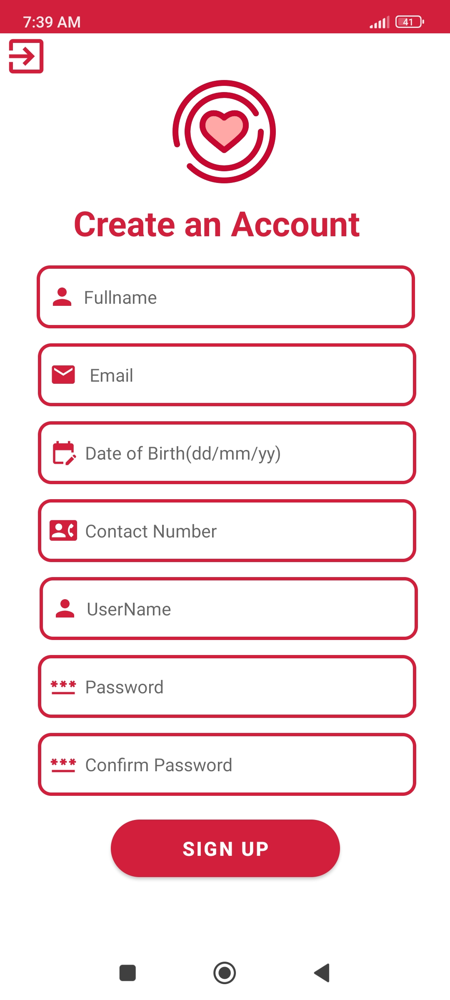
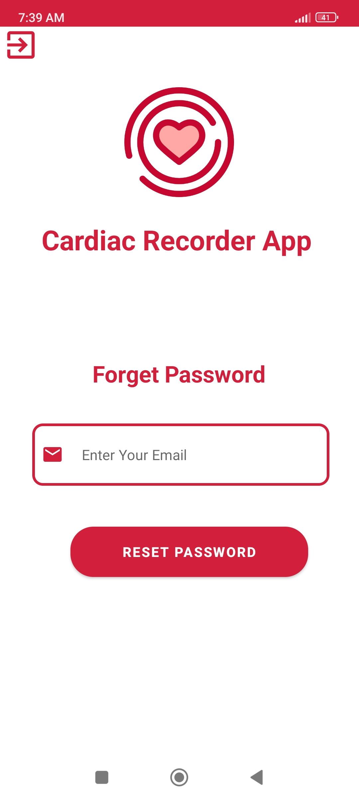
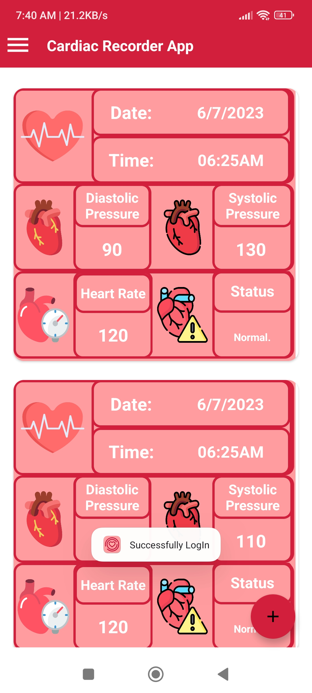
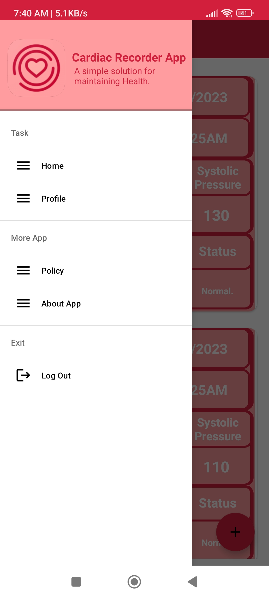
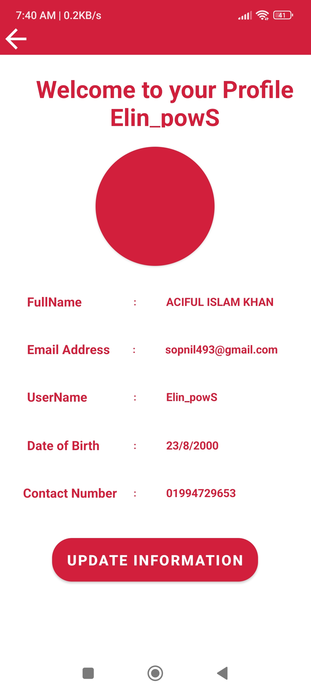
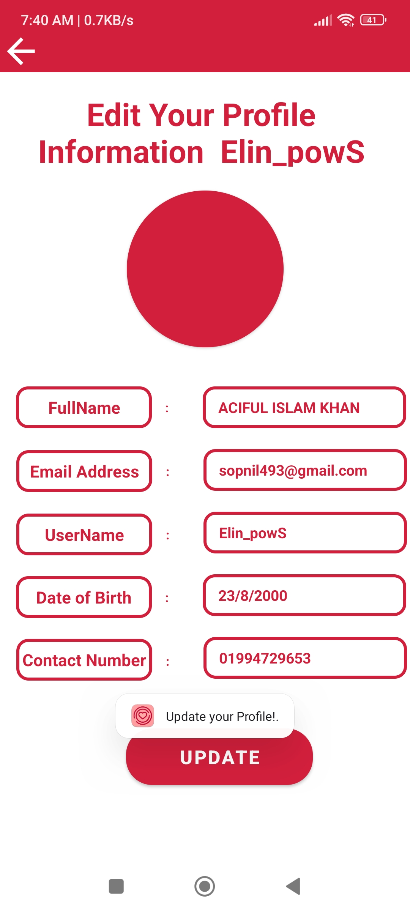
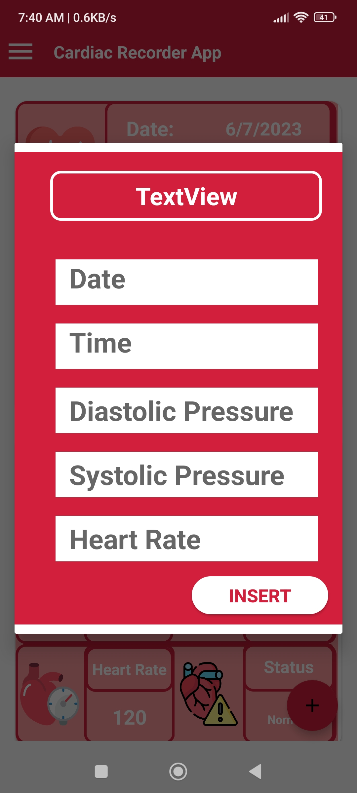
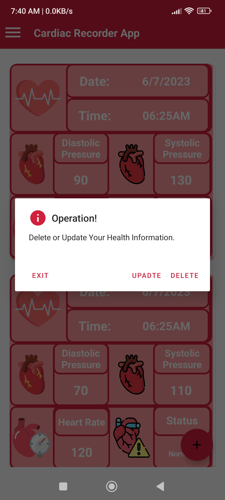
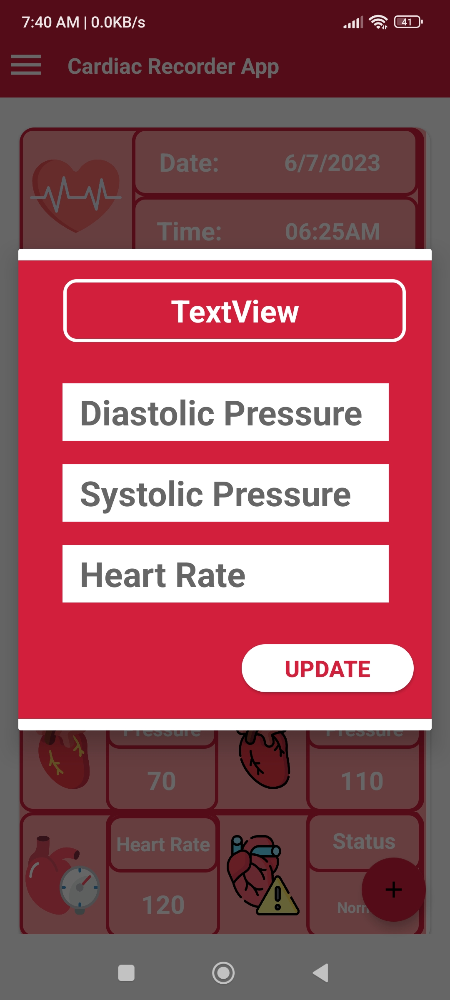

# Cardiac Recorder

Cardiac Recorder is a simple, useful, and user-friendly Android application for monitoring heart rate and blood pressure. It allows users to track their cardiac history and stay informed about their cardiovascular health.

## Screenshots

  
  

  
  

  
   
  <!-- Add more screenshots here -->

  
  

  

  
  

## Features

- Heart rate monitoring: Measure your heart rate using the device's camera or compatible sensor.
- Blood pressure monitoring: Track your blood pressure levels and monitor changes over time.
- Cardiac history: View and analyze your previous heart rate and blood pressure readings.
- User-friendly interface: Intuitive design for easy navigation and a seamless user experience.

## Usage

1. Launch the Cardiac Recorder application on your Android device.
2. Grant the necessary permissions for the app to access the camera or any other required sensors.
3. Follow the on-screen instructions to measure your heart rate or blood pressure.
4. View your cardiac history to track your progress and monitor changes over time.

## Documentation

For detailed documentation, please refer to the [Cardiac Recorder Wiki](https://github.com/saugataroyarghya/Cardiac_Recorder/wiki).

## License

This project is licensed under the [MIT License](LICENSE.md).

## Authors

- Saugata Roy Arghya, Roll: 1907116
- Aciful Islam Khan Swopnile, Roll: 1907119
